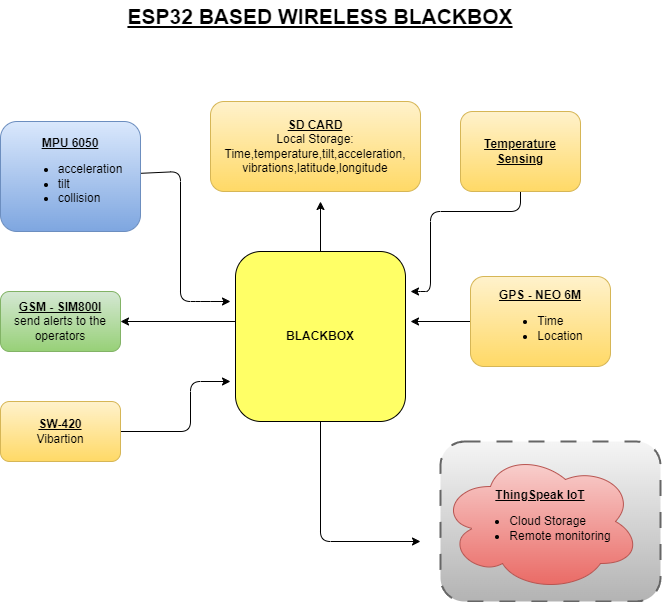
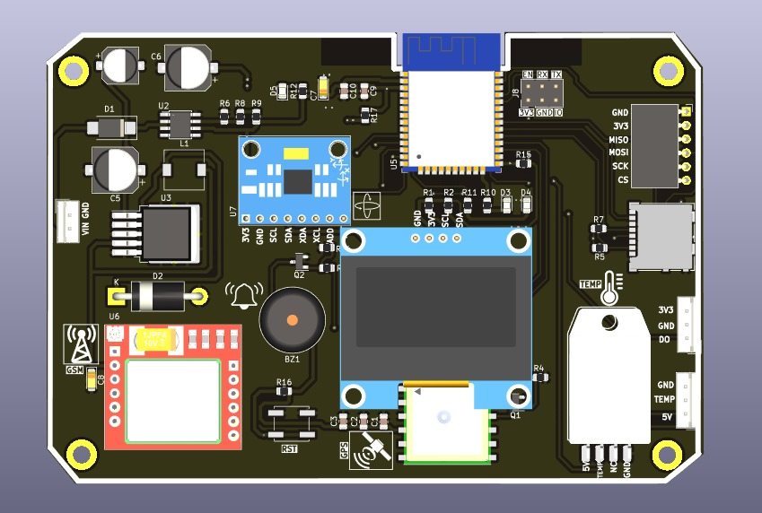
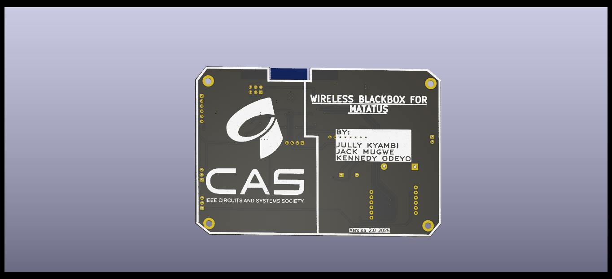

# Name
ESP32basedBlackbox

## Description
A Wireless Blackbox for PSV monitoring, tailored for "Matatu" operators. The system monitors:
        -acceleration of the vehicle
        -the tilt
        -temperature of engine area
        -vibration

Monitored parameters are sent to a cloud palatform(ThingsPeak for this case) and also locally stored on the onboard SD card memory.

## Table of Contents
- [Block Diagram](#Block_Diagram)
- [PCB](#PCB)
- [Prototype](#Prototype)
- [License](#license)

## Block Diagram
The block diagram of the system is as shown below:

## PCB
The PCB is designed using KiCAD. The major hardware include:
1.ESP32-S3 -this is the main "brain" of the system. Its specifications, particularly speed & RF(WiFi) capabilities made it suitable for the use case
2.mpu6050 - measures the acceleration, tilt, and speed
3.L80 -R GPS module - connects with satellits to get the latitude and longitude coordinates of the device
4.SIM800L GSM Module - used for its GSM to send instant alerts via SMS. It is GPRS enabled and can be used as backup when there is no WiFi
5.buzzer - auditory alerts for the driver & passengers on board
6.temperature sensor(DHT used here) - external slot is allocated to attach an external temperatures sensor
7.SD card connector - for mounting SD card

The Top and Bottom models are as shown:
 

## Prototype
The assembeled protoboard:

## License
MIT
